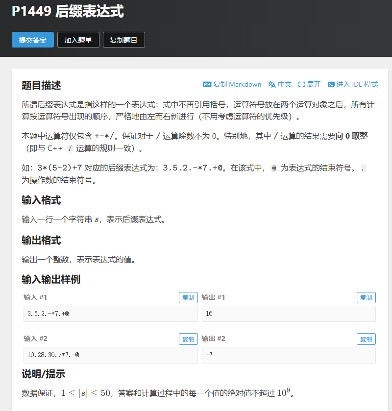

# 【算法题】P1449 后缀表达式
## 题目链接：https://www.luogu.com.cn/problem/P1449
## 题目截图
 <!-- 本地图片用相对路径，比如./images/最小波动值题目.png -->
# 后缀表达式（逆波兰表达式）求值问题总结

## 题目核心
1. **问题定义**：后缀表达式将运算符放在两个操作数之后，无需括号和运算符优先级，严格从左到右计算；本题运算符仅包含`+-*/`，除法保证除数非0且结果向0取整（与C++ `/` 规则一致），特殊分隔符：`.`为操作数结束符，`@`为表达式结束符。
2. **核心解法**：利用**栈（Stack）** 实现计算：
   - 遇到数字时，拼接字符直到`.`，转为数字压入栈；
   - 遇到运算符时，弹出栈顶两个数（先弹右操作数，后弹左操作数），按运算符计算后将结果压栈；
   - 遇到`@`时终止遍历，栈中剩余唯一元素即为最终结果。
3. **示例**：`3*(5-2)+7` 对应的后缀表达式`3.5.2.-*7.+@`，计算结果为16。

## 新学知识点总结
1. **STL栈（stack）的使用**
   - 核心接口：`push()`（压栈）、`pop()`（弹栈，无返回值）、`top()`（获取栈顶元素）；
   - 特性：后进先出（LIFO），完美适配后缀表达式“先存操作数、后取数计算”的逻辑。
2. **字符串转数字的实用技巧**
   - 多位数处理：通过临时字符串拼接数字字符，遇到`.`时用`atoi()`/`stoi()`转为整数；
   - 兼容/安全选择：`atoi()`兼容旧C++版本（需`c_str()`转换），`stoi()`（C++11+）支持异常处理更安全。
3. **后缀表达式计算逻辑**
   - 运算符处理顺序：栈顶弹出的第一个数是右操作数，第二个数是左操作数（如`5.2.-`需计算`5-2`，而非`2-5`）；
   - 除法规则：C++的`/`运算符天然满足“向0取整”（如`10/3=3`、`-10/3=-3`）。

## 踩坑点（重点！）
1. **操作数顺序错误**
   - 错误行为：将弹出的第一个数作为左操作数、第二个数作为右操作数；
   - 后果：减法/除法结果完全错误（如`5-2`算成`2-5`）；
   - 解决方案：严格遵循“先弹右操作数（num2），后弹左操作数（num1），计算`num1 运算符 num2`”。
2. **多位数未拼接直接处理**
   - 错误行为：遇到单个数字字符直接压栈，未处理`123.`这类多位数；
   - 后果：`123.`被拆分为`1`、`2`、`3`三个数压栈，结果错误；
   - 解决方案：用临时字符串`numStr`拼接连续数字字符，遇到`.`时再转数字压栈。
3. **栈空时调用top()/pop()**
   - 错误行为：未校验栈大小就弹出元素（如表达式格式错误时）；
   - 后果：程序崩溃（栈操作越界）；
   - 解决方案：增加栈大小校验（如`if (numStack.size() < 2) throw 异常;`）。
4. **混淆C/C++字符串转换**
   - 错误行为：`atoi()`直接传入C++ string（如`atoi(numStr)`）；
   - 后果：编译报错（`atoi()`要求`const char*`）；
   - 解决方案：`atoi(numStr.c_str())` 或直接用`stoi(numStr)`。


## 最终AC代码
```cpp
#include <bits/stdc++.h>
#define ios ios::sync_with_stdio(false), cin.tie(0), cout.tie(0);
#define x first
#define y second
#define int long long
using namespace std;
typedef pair<int, int> PII;
const int N = 1e6 + 10;
const int M = 2e5 + 10;
const int INF = 0x3f3f3f3f;
const double INFF = 0x7f7f7f7f7f7f7f7f;
const int mod = 1e9 + 7;
int t, n, a[N];

// 计算后缀表达式的核心函数
int calculatePostfix(const string& expr) {
    stack<int> numStack; // 存储操作数的栈
    string numStr;       // 临时存储拼接的操作数字符串

    for (char c : expr) {
        // 1. 遇到结束符@，终止遍历
        if (c == '@') {
            break;
        }

        // 2. 遇到操作数结束符.，将拼接的数字压栈并清空临时字符串
        if (c == '.') {
            if (!numStr.empty()) {
                int num = atoi(numStr.c_str()); // 字符串转整数
                numStack.push(num);
                numStr.clear(); // 清空临时字符串，准备下一个操作数
            }
            continue;
        }

        // 3. 遇到数字，拼接临时字符串
        if (c >= '0' && c <= '9') {
            numStr += c;
            continue;
        }

        // 4. 遇到运算符，执行计算
        if (c == '+' || c == '-' || c == '*' || c == '/') {
            // 弹出两个操作数（注意顺序：栈顶是右操作数，次顶是左操作数）
            int num2 = numStack.top();
            numStack.pop();
            int num1 = numStack.top();
            numStack.pop();

            int res = 0;
            switch (c) {
                case '+':
                    res = num1 + num2;
                    break;
                case '-':
                    res = num1 - num2;
                    break;
                case '*':
                    res = num1 * num2;
                    break;
                case '/':
                    // 题目保证除数不为0，除法向0取整（C++默认规则）
                    res = num1 / num2;
                    break;
            }

            // 计算结果压栈
            numStack.push(res);
        }
    }

    // 最终栈中仅剩一个元素，即为结果
    return numStack.top();
}

// P1449 后缀表达式 不用考虑运算符优先级  std::stack<int> s
signed main()
{
	ios;
	
	string s;
	cin >> s;
	
	int res = calculatePostfix(s);
	cout << res << '\n';
	
    return 0;
}
```
